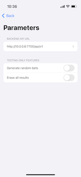

# Sports Bets iOS

**Sports Bets iOS** is an open-source iOS application designed to interact with the [Sports Bets Backend](https://github.com/Yuumi-Software/sport-bets-backend). This project is primarily intended for learning and demonstrating SwiftUI development practices while building a functional sports betting app.

## Changelog
All notable changes to this project will be documented in the [CHANGELOG.md](./CHANGELOG.md) file.

## Features
- View a list of competitions.
- View a list of matches, place bets, and check results.
- Login as a registered user and configure the app.

### Screenshots (version 0.2.0)

## Technical concepts used and implemented

- **Web API Integration:** Communicates with the [Sports Bets Backend](https://github.com/Yuumi-Software/sport-bets-backend) via RESTful APIs to retrieve and display sports competitions and betting data.
- **MVVM Architecture:** Implements the Model-View-ViewModel (MVVM) pattern to separate concerns and improve testability.
- **Asynchronous Data Handling:** Uses Combine for reactive programming and handling asynchronous data streams from the backend.
- **JSON Decoding:** Decodes JSON responses into Swift model objects using `Codable`.
- **SwiftUI-based UI:** The app is built entirely using SwiftUI.

## Getting Started

### Prerequisites

- **Xcode 12** or later
- **iOS 14** or later
- **Swift 5.3** or later

### Configuration
Ensure that the app is correctly configured to connect with the Sports Bets Backend:

API Base URL: Network/BackendApi/baseUrl

### Usage (under heavy development at the moment)

Home Screen: Displays a list of upcoming sports competitions fetched from the backend.
Competition Details: Tap on a competition to view detailed information and available bets.
Placing Bets: Select the desired outcome and place a bet through the app (simulation mode, no real transactions).

### Contributing

We welcome contributions! If you want to contribute:

Fork the repository.
Create a feature branch (git checkout -b feature/YourFeature).
Commit your changes (git commit -m 'Add some feature').
Push to the branch (git push origin feature/YourFeature).
Open a Pull Request.

### Reporting Issues
If you find a bug or have a feature request, please open an issue on GitHub.

### License

This project is licensed under the MIT License - see the LICENSE file for details.

### Acknowledgments

This project uses the Sports Bets Backend developed by Yuumi Software.
Thanks to the open-source community for all the contributions and resources.

A special thanks to Paul Hegarty for his Stanford course on developing iOS apps.

### Learning Resources

SwiftUI Documentation
Combine Framework Documentation
JSON and Codable in Swift
MVVM Design Pattern in iOS
